# VietType

<div align="center">



**Bộ gõ tiếng Việt hiện đại, mượt mà và nhẹ nhàng dành cho hệ điều hành Windows.**

[](LICENSE)
[](https://dotnet.microsoft.com/)
[](https://microsoft.com/windows)
[]()
[]()

</div>

---

## Giới thiệu

VietType là bộ gõ tiếng Việt được thiết kế và phát triển bằng C# trên nền tảng .NET 8 và WPF. Với triết lý đơn giản, hiện đại và tối ưu hiệu năng, VietType mang lại trải nghiệm gõ phím mượt mà, phản hồi tức thì và tương thích tối đa với các ứng dụng Windows 10/11.

---

## Tính năng nổi bật

- **Kiến trúc chạy ngầm độc lập (`AppBackgroundContext`)**:
  - Tách biệt hoàn toàn vòng đời ứng dụng khỏi giao diện chính (`MainWindow`), trao quyền quản lý System Tray, Keyboard Hook và Phím tắt cho background context chuyên biệt.
  - Loại bỏ hoàn toàn lỗi màn hình đen xì trên các dòng GPU / Intel Iris Xe khi tắt tùy chọn *"Hiện hộp thoại khi khởi động"*.
  - Tiết kiệm tài nguyên RAM, đóng mở giao diện mượt mà và giải phóng bộ nhớ sạch sẽ khi đóng cửa sổ (`Close()`).

- **Giao diện Fluent tối giản và hiện đại**:
  - Hỗ trợ đầy đủ chủ đề Sáng (Light), Tối (Dark) và Tự động theo hệ thống Windows (Auto).
  - Sidebar đồng bộ hoàn toàn với chủ đề: chuyển Light/Dark là toàn bộ màu sắc nền, icon, chữ và trạng thái chọn của sidebar cập nhật tức thì.
  - Khung cửa sổ tùy biến (`VietTypeWindow`) thuần WPF `WindowChrome`: căn chỉnh hoàn hảo khi Maximize không bị khuyết viền, nút điều khiển (Minimize, Maximize, Close) nhận diện click chuẩn xác.

- **Hỗ trợ đầy đủ các kiểu gõ thông dụng & tinh chỉnh nâng cao**:
  - **Telex**: Kiểu gõ phổ biến nhất.
  - **VNI**: Gõ số bỏ dấu truyền thống.
  - **VIQR**: Kiểu gõ theo chuẩn ký tự ASCII.
  - **Telex mở rộng**: Tinh chỉnh linh hoạt, gõ `w` hoặc `]` ra `ư` (gõ `W` / `}` ra `Ư`), gõ `[` ra `ơ` (gõ `{` ra `Ơ`), gõ đúp `ww` / `]]` / `[[` khôi phục ký tự gốc.

- **Cho phép kiểu gõ hiện đại**:
  - Tùy chọn đặt dấu thanh theo chuẩn ngữ âm hiện đại (đặt dấu vào âm chính thay vì âm đệm): ví dụ `hoà`, `thuỷ`, `khoẻ` thay vì `hòa`, `thủy`, `khỏe`.
  - Đồng bộ hóa dễ dàng giữa bảng cài đặt và menu chuột phải khay hệ thống.

- **Hỗ trợ 17 Bảng mã tiếng Việt chuẩn hóa**:
  - Unicode (Dựng sẵn), Unicode (Tổ hợp)
  - TCVN3 (ABC), VNI Windows, VIQR
  - Vietnamese locale CP 1258
  - BKHCM 1, BKHCM 2
  - Vietware X, Vietware F
  - Unicode UTF-8, Unicode NCR Decimal, Unicode NCR Hex, Unicode C String
  - TCVN 6064, VPS, VISCII

- **Gợi ý từ thông minh (Auto Complete)**:
  - Dự đoán và gợi ý từ vựng tiếng Việt nhanh chóng, hỗ trợ tăng tốc độ soạn thảo văn bản.

- **Trang chuyên biệt cho từng tính năng**:
  - Trang Tổng quan được tinh giản tối đa: bật/tắt bộ gõ, kiểu gõ, bảng mã, thử nhanh.
  - Trang Phím tắt: tập trung toàn bộ thiết lập tổ hợp phím tại một nơi duy nhất.
  - Gõ tắt (Shortcuts / Macro): Tự động thay thế từ viết tắt thành văn bản hoàn chỉnh.

- **Âm thanh và thông báo phản hồi**:
  - Âm thanh ngắn tổng hợp ngay trong ứng dụng (sine wave, không cần file .wav): chime đi lên khi bật bộ gõ, đi xuống khi tắt, tick trung tính khi chuyển kiểu gõ/bảng mã.
  - Balloon thông báo cho mọi thao tác: bật/tắt bộ gõ (nút gạt, tray icon, phím tắt), chuyển kiểu gõ, bảng mã, kiểm tra chính tả, gõ tắt.
  - Có thể tắt âm thanh phản hồi trong tab Nâng cao.

- **Tổ hợp phím chức năng nhanh (F1 - F12)**:

  | Phím | Chức năng |
  |------|-----------|
  | `F1` | Bật bộ gõ tiếng Việt |
  | `F2` | Tắt bộ gõ tiếng Việt |
  | `F3` | Chọn bảng mã Unicode |
  | `F4` | Chuyển sang bảng mã kế tiếp |
  | `F5` | Mở bảng điều khiển |
  | `F6` | Bật / tắt kiểm tra chính tả |
  | `F7` | Chèn ngày hiện tại (dd/MM/yyyy) |
  | `F8` | Mở trang Gõ tắt |
  | `F9` | Bật / tắt gõ tắt |
  | `F12` | Reset bộ nhớ đệm bộ gõ |

  - Mỗi phím có thể bật/tắt độc lập, phím bổ trợ (Ctrl + Shift + Alt) tùy chỉnh được, kèm thông báo balloon khi kích hoạt.

- **Kiểm tra chính tả và phục hồi từ gốc**:
  - Nhận diện lỗi từ vựng tiếng Việt theo thời gian thực.
  - Tự động hoàn tác/khôi phục từ gốc khi phát hiện sai hoặc khi người dùng chỉnh sửa.

- **Khởi động cùng Windows đồng bộ & Chạy Admin không cần UAC**:
  - Đồng bộ hóa 2 chiều trạng thái checkbox khởi động giữa các trang cài đặt.
  - Khởi động chế độ người dùng chuẩn thông qua Windows Registry (`HKCU\Software\Microsoft\Windows\CurrentVersion\Run`).
  - Hỗ trợ Task Scheduler (RunLevel Highest) cho quyền Administrator: tự động đăng nhập elevated hoặc nâng quyền chạy mà **không cần hộp thoại UAC** (kiểu EVKey).

- **Tương thích quyền Administrator**:
  - Hỗ trợ chạy với quyền Quản trị viên để gõ mượt mà trên các ứng dụng nâng cao, IDE, Terminal và Game.

- **Menu khay hệ thống (System Tray) tiện lợi**:
  - Truy cập nhanh kiểu gõ, bảng mã, bật/tắt gợi ý và các tùy chọn trực tiếp từ khay hệ thống với thiết kế phẳng, liền mạch.

---

## Cấu trúc dự án

```text
VietType/
├── LICENSE                         # Giấy phép mã nguồn mở MIT
├── README.md                       # Tài liệu dự án
├── VietType.slnx                   # File giải pháp Solution .NET
└── VietType/
    ├── VietType.csproj             # Dự án WPF .NET 8.0-windows
    ├── App.xaml / App.xaml.cs      # Điểm khởi chạy ứng dụng và quản lý vòng đời
    ├── MainWindow.xaml / .cs       # Cửa sổ chính, Sidebar Navigation, Tray Icon Menu
    ├── AboutWindow.xaml / .cs      # Cửa sổ Giới thiệu
    ├── Core/
    │   ├── Typing/                 # Engine xử lý phím, giải thuật tiếng Việt
    │   └── Models/                 # Cấu hình ứng dụng, dữ liệu phím tắt
    ├── Controls/                   # Custom Control (NavItem, SettingCard, ToggleSwitch, ...)
    ├── Pages/
    │   ├── HomePage.xaml           # Tổng quan (Kiểu gõ, Bảng mã, Thử nhanh)
    │   ├── InputPage.xaml          # Tinh chỉnh xử lý tiếng Việt, tương thích hệ thống
    │   ├── HotkeysPage.xaml        # Cài đặt tổ hợp phím tắt và F-key chức năng
    │   ├── ShortcutsPage.xaml      # Quản lý danh sách gõ tắt (Macro)
    │   ├── AdvancedPage.xaml       # Cấu hình nâng cao, Theme, khởi động cùng Windows
    │   └── AboutPage.xaml          # Thông tin tác giả và bản quyền
    ├── Data/
    │   └── EncodingTables/         # Tập hợp 17 bảng mã tiếng Việt
    ├── Infrastructure/             # Lưu trữ cài đặt, Registry, IO
    ├── Platform/                   # Keyboard hook (Win32 API), Elevation Helper
    ├── Themes/                     # Bộ màu Light/Dark Mode, Style XAML, ThemeManager
    └── Resources/                  # Vector icon SVG, logo ứng dụng, tài liệu
```

---

## Hướng dẫn cài đặt và chạy ứng dụng

### Yêu cầu hệ thống
- Hệ điều hành: Windows 10 / 11 (x64 / ARM64).
- Bộ công cụ phát triển: [.NET 8.0 SDK](https://dotnet.microsoft.com/download/dotnet/8.0) hoặc mới hơn.
- Môi trường khuyến nghị: Visual Studio 2022 / Visual Studio Code với C# Dev Kit.

### Các bước biên dịch

1. Khôi phục phụ thuộc (Restore dependencies):
   ```bash
   dotnet restore VietType.slnx
   ```

2. Biên dịch dự án (Build):
   ```bash
   dotnet build VietType.slnx -c Release
   ```

3. Chạy ứng dụng (Run):
   ```bash
   dotnet run --project VietType/VietType.csproj
   ```

---

## Bản quyền

Dự án được phân phối dưới giấy phép mã nguồn mở [MIT License](LICENSE).

---

## Tác giả

- Tran Khanh ([@khanh779-9](https://github.com/khanh779-9))
